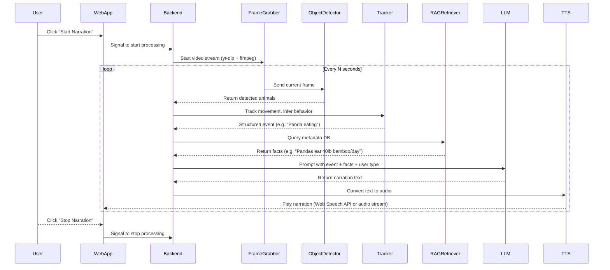

# 🦁 Wildlife Narration Web App (Lit + AI)

A web-based proof-of-concept for **real-time narration of animal behavior** from **live YouTube animal streams**, designed for **visually impaired users**. Built with modern Web Components (Lit), HuggingFace models, RAG + LLM pipelines, and browser speech synthesis.

---

## 📸 Features

- Watch live animal cams (YouTube Live)
- Detect and narrate animal behavior using AI
- Narration style filter: **adults** or **minors**
- Browser-based text-to-speech (TTS)
- On-demand inference (runs only when narration is requested)

---

## 🧠 System Architecture



---

## 🧱 Tech Stack

| Layer            | Tool/Library                        |
|------------------|------------------------------------|
| Frontend         | Lit, Tailwind CSS                   |
| Stream Source    | YouTube Live via [yt-dlp]           |
| Frame Capture    | FFmpeg / OpenCV                     |
| Object Detection | YOLOv8 / HuggingFace DETR           |
| Behavior Logic   | DeepSORT / custom heuristics        |
| Metadata         | LangChain + FAISS (RAG)             |
| Language Model   | OpenAI GPT-4 / LLaMA                |
| Text-to-Speech   | Web Speech API or Google TTS        |

---

## 🧪 Quickstart

1. **Clone and serve locally**

   ```bash
   git clone <this-repo-url>
   cd wildlife-narration
   ```

   You'll need a static server. Use Python or Node:

   **Using Python:**
   ```bash
   python -m http.server 8000
   ```

   **Using Node:**
   ```bash
   npm install -g lite-server
   lite-server
   ```

2. **Open in your browser**

   [http://localhost:8000](http://localhost:8000)

---

## 💡 How It Works

- The frontend displays a grid of categorized YouTube Live streams.
- When a user clicks "Narrate," the backend:
  1. Fetches frames from the stream
  2. Runs object detection (YOLO, DETR)
  3. Tracks animal movement
  4. Infers actions (e.g. eating, walking)
  5. Retrieves facts via RAG (LangChain + FAISS)
  6. Sends all to an LLM (e.g. GPT-4) for a 1–2 sentence narration
  7. Sends narration text to browser for speech via Web Speech API

---

## 👩‍🦯 Accessibility

- Designed for screen reader users and blind individuals
- Narration adapts to user age:
  - **Adult:** full factual description
  - **Minor:** child-appropriate filtering
- Narration uses a clear, calm TTS voice

---

## 🚧 Roadmap / To-Do

- [ ] Hook up real backend (FastAPI or Node) with frame processor
- [ ] Use yt-dlp to extract direct stream URL
- [ ] Integrate YOLOv8 from HuggingFace or Ultralytics
- [ ] Add LangChain-based metadata lookup
- [ ] Plug in OpenAI GPT or local LLM
- [ ] Offer multilingual narration (e.g. Arabic, German)
- [ ] Add analytics (optional for zoo partners)

---

## 🧩 Credits & Sources

- Explore.org for video sources
- OpenAI for GPT access
- HuggingFace for object detection models
- LangChain for RAG architecture
- Tailwind CSS for frontend styling

---

## 🆘 Questions?

If you'd like help wiring the backend, selecting models, or optimizing for edge devices — reach out or open an issue in the repo!